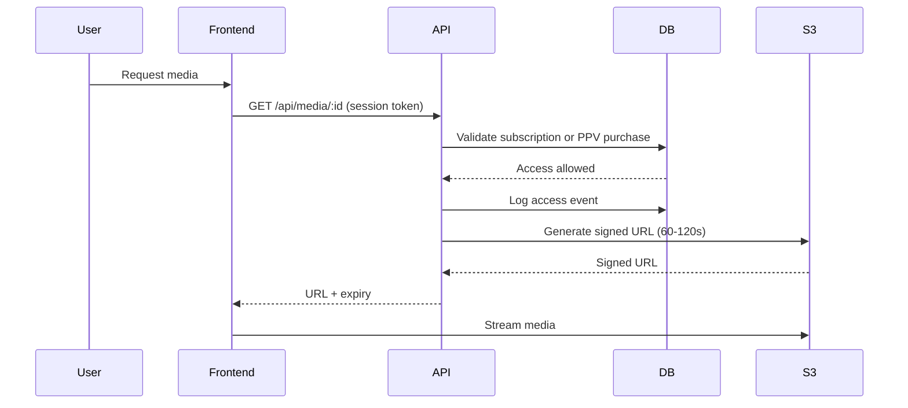

# InnerCircle Architecture

## Overview
InnerCircle is a privacy-first creator platform built with a Next.js frontend, a Node.js/Express backend, and a Postgres database. Wallet-based sessions control access, and gated media is delivered only after verified on-chain payments.

Core services:
- Frontend: Next.js app with wallet connections, creator studio, and gated media playback.
- Backend API: Express app handling creators, subscriptions, tips, analytics, and media access.
- Postgres: Stores creators, content metadata, purchases, tips, and access events.
- S3: Stores encrypted media assets and thumbnails. Access is granted via short-lived signed URLs.

## Media Security Flow
Media is never exposed directly. The backend issues short-lived signed URLs only after validating access.

## Subscription Validation
Subscriptions are verified against on-chain payments and stored as verified purchases. Each purchase includes tier pricing and an optional tier ID.

- Verify purchase: `POST /api/subscriptions/verify`
- Session creation: `POST /api/sessions/create` (subscription-direct)
- Tier gating: enforced when issuing media URLs (purchase price vs required tier price)

## Tipping System
Tips are enforced on-chain. Public tips use `credits.aleo/transfer_public`, while anonymous tips use a private
tip program (`tip_pay_v2_xwnxp.aleo`) that pays from private balance and proves the amount without revealing identity.

- Public tip: `POST /api/tips` (wallet session + `txId`)
- Anonymous tip: `POST /api/tips/anonymous` (no session, `txId` from `tip_private`)
- Tip history: `GET /api/tips/history` (fan) or `GET /api/tips/creator/:handle` (creator)
- Leaderboard: `GET /api/tips/leaderboard/:handle` (public, anonymous tips excluded)

## Analytics System
Analytics combine purchases, tips, and access events.

Metrics:
- total subscribers
- active subscriptions
- churn rate (30 days)
- revenue (subscription, PPV, tips)
- content views

Charts:
- 30-day revenue (subscription + PPV + tips)
- 30-day content views

## Security Controls
- Short-lived signed URLs (60-120 seconds).
- Rate limiting on API routes.
- Request validation with Zod schemas.
- Wallet session tokens for creator actions and uploads.
- Access logging via `StreamEvent` records.
- Private S3 bucket with public access blocked.

## Creator Verification
Creator verification uses a dedicated workflow and status table.

- Submit request: `POST /api/verifications/submit`
- Review status: `GET /api/verifications/:handle`

## Deployment Notes
- Configure S3 with a private bucket and block public access.
- Set `SIGNED_URL_EXPIRATION` to a value between 60 and 120 seconds.
- Enable TLS on API and frontend.
